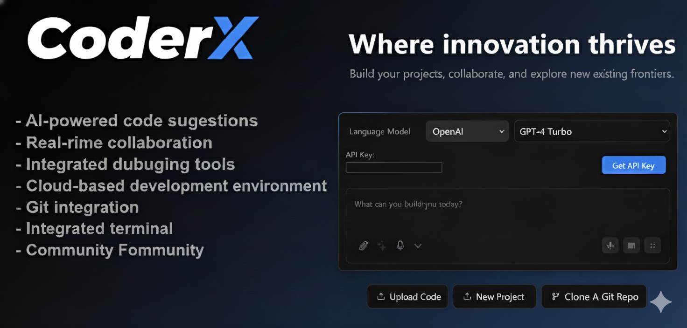

[](https://github.com/Suryanshu-Nabheet/CoderX)

<div align="center">

# CoderX
### AI-Powered Development Platform

[](https://github.com/Suryanshu-Nabheet/CoderX)
[](https://github.com/Suryanshu-Nabheet/CoderX)
[](https://github.com/Suryanshu-Nabheet/CoderX/issues)
[](https://github.com/Suryanshu-Nabheet/CoderX/blob/main/LICENSE)
[](https://www.typescriptlang.org/)
[](https://reactjs.org/)
[](https://remix.run/)
[](https://github.com/Suryanshu-Nabheet/CoderX)

</div>

Welcome to CoderX, the AI-powered development platform that allows you to choose the LLM that you use for each prompt! Currently, you can use OpenAI, Anthropic, Ollama, OpenRouter, Gemini, LMStudio, Mistral, xAI, HuggingFace, DeepSeek, Groq, Cohere, Together, Perplexity, Moonshot (Kimi), Hyperbolic, GitHub Models, Amazon Bedrock, and OpenAI-like providers - and it is easily extended to use any other model supported by the Vercel AI SDK! See the instructions below for running this locally and extending it to include more models.

> **⭐ If you find CoderX useful, please give it a star on GitHub!**  
> **🐛 Found a bug? [Report it here](https://github.com/Suryanshu-Nabheet/CoderX/issues)**  
> **💡 Have an idea? [Open an issue](https://github.com/Suryanshu-Nabheet/CoderX/issues)**  
> **🤝 Want to contribute? [Check our contributing guide](https://github.com/Suryanshu-Nabheet/CoderX/blob/main/CONTRIBUTING.md)**

-----

-----
Join our community discussions on [GitHub Issues](https://github.com/Suryanshu-Nabheet/CoderX/issues) for support, feature requests, and sharing your projects!

CoderX is an AI-powered development platform created by [Suryanshu Nabheet](https://github.com/Suryanshu-Nabheet)!

## About the Creator

**Suryanshu Nabheet** is a Full Stack Developer and AI/ML enthusiast who created CoderX to provide developers with a powerful, AI-driven development platform. With expertise in modern web technologies, blockchain development, and cloud architecture, Suryanshu has built CoderX to be a comprehensive solution for AI-powered development.

**Connect with Suryanshu:**
- 🌐 [LinkedIn](https://www.linkedin.com/in/suryanshu-nabheet/)
- 💻 [GitHub](https://github.com/Suryanshu-Nabheet)
- 🐦 [Twitter/X](https://x.com/suryanshuxdev)

## Table of Contents

- [Join the Community](#join-the-community)
- [Recent Major Additions](#recent-major-additions)
- [Features](#features)
- [Setup](#setup)
- [Quick Installation](#quick-installation)
- [Manual Installation](#manual-installation)
- [Configuring API Keys and Providers](#configuring-api-keys-and-providers)
- [Setup Using Git (For Developers only)](#setup-using-git-for-developers-only)
- [Available Scripts](#available-scripts)
- [Contributing](#contributing)
- [FAQ](#faq)

## Join the community

[Join the CoderX community on GitHub Issues!](https://github.com/Suryanshu-Nabheet/CoderX/issues)

## Project management

CoderX is a community effort! Still, the core team of contributors aims at organizing the project in way that allows
you to understand where the current areas of focus are.

If you want to know what we are working on, what we are planning to work on, or if you want to contribute to the
project, please check the [project management guide](./PROJECT.md) to get started easily.

## Recent Major Additions

### ✅ Completed Features
- **19+ AI Provider Integrations** - OpenAI, Anthropic, Google, Groq, xAI, DeepSeek, Mistral, Cohere, Together, Perplexity, HuggingFace, Ollama, LM Studio, OpenRouter, Moonshot, Hyperbolic, GitHub Models, Amazon Bedrock, OpenAI-like
- **Electron Desktop App** - Native desktop experience with full functionality
- **Advanced Deployment Options** - Netlify, Vercel, and GitHub Pages deployment
- **Supabase Integration** - Database management and query capabilities
- **Data Visualization & Analysis** - Charts, graphs, and data analysis tools
- **MCP (Model Context Protocol)** - Enhanced AI tool integration
- **Search Functionality** - Codebase search and navigation
- **File Locking System** - Prevents conflicts during AI code generation
- **Diff View** - Visual representation of AI-made changes
- **Git Integration** - Clone, import, and deployment capabilities
- **Expo App Creation** - React Native development support
- **Voice Prompting** - Audio input for prompts
- **Bulk Chat Operations** - Delete multiple chats at once
- **Project Snapshot Restoration** - Restore projects from snapshots on reload

### 🔄 In Progress / Planned
- **File Locking & Diff Improvements** - Enhanced conflict prevention
- **Backend Agent Architecture** - Move from single model calls to agent-based system
- **LLM Prompt Optimization** - Better performance for smaller models
- **Project Planning Documentation** - LLM-generated project plans in markdown
- **VSCode Integration** - Git-like confirmations and workflows
- **Document Upload for Knowledge** - Reference materials and coding style guides
- **Additional Provider Integrations** - Azure OpenAI, Vertex AI, Granite

## Features

- **AI-powered full-stack web development** for **NodeJS based applications** directly in your browser.
- **Support for 19+ LLMs** with an extensible architecture to integrate additional models.
- **Attach images to prompts** for better contextual understanding.
- **Integrated terminal** to view output of LLM-run commands.
- **Revert code to earlier versions** for easier debugging and quicker changes.
- **Download projects as ZIP** for easy portability and sync to a folder on the host.
- **Integration-ready Docker support** for a hassle-free setup.
- **Deploy directly** to **Netlify**, **Vercel**, or **GitHub Pages**.
- **Electron desktop app** for native desktop experience.
- **Data visualization and analysis** with integrated charts and graphs.
- **Git integration** with clone, import, and deployment capabilities.
- **MCP (Model Context Protocol)** support for enhanced AI tool integration.
- **Search functionality** to search through your codebase.
- **File locking system** to prevent conflicts during AI code generation.
- **Diff view** to see changes made by the AI.
- **Supabase integration** for database management and queries.
- **Expo app creation** for React Native development.

## Setup

If you're new to installing software from GitHub, don't worry! If you encounter any issues, feel free to submit an "issue" using the provided links or improve this documentation by forking the repository, editing the instructions, and submitting a pull request. The following instruction will help you get the stable branch up and running on your local machine in no time.

Let's get you up and running with the stable version of CoderX!

## Quick Installation

[](https://github.com/Suryanshu-Nabheet/CoderX/releases/latest) ← Click here to go to the latest release version!

- Download the binary for your platform (available for Windows, macOS, and Linux)
- **Note**: For macOS, if you get the error "This app is damaged", run:
  ```bash
  xattr -cr /path/to/CoderX.app
  ```

## Manual installation


### Option 1: Node.js

Node.js is required to run the application.

1. Visit the [Node.js Download Page](https://nodejs.org/en/download/)
2. Download the "LTS" (Long Term Support) version for your operating system
3. Run the installer, accepting the default settings
4. Verify Node.js is properly installed:
   - **For Windows Users**:
     1. Press `Windows + R`
     2. Type "sysdm.cpl" and press Enter
     3. Go to "Advanced" tab → "Environment Variables"
     4. Check if `Node.js` appears in the "Path" variable
   - **For Mac/Linux Users**:
     1. Open Terminal
     2. Type this command:
        ```bash
        echo $PATH
        ```
     3. Look for `/usr/local/bin` in the output

## Running the Application

You have two options for running CoderX: directly on your machine or using Docker.

### Option 1: Direct Installation (Recommended for Beginners)

1. **Install Package Manager (pnpm)**:

   ```bash
   npm install -g pnpm
   ```

2. **Install Project Dependencies**:

   ```bash
   pnpm install
   ```

3. **Start the Application**:

   ```bash
   pnpm run dev
   ```
   
### Option 2: Using Docker

This option requires some familiarity with Docker but provides a more isolated environment.

#### Additional Prerequisite

- Install Docker: [Download Docker](https://www.docker.com/)

#### Steps:

1. **Build the Docker Image**:

   ```bash
   # Using npm script:
   npm run dockerbuild

   # OR using direct Docker command:
   docker build . --target coderx-development
   ```

2. **Run the Container**:
   ```bash
   docker compose --profile development up
   ```

### Option 3: Desktop Application (Electron)

For users who prefer a native desktop experience, CoderX is also available as an Electron desktop application:

1. **Download the Desktop App**:
   - Visit the [latest release](https://github.com/Suryanshu-Nabheet/CoderX/releases/latest)
   - Download the appropriate binary for your operating system
   - For macOS: Extract and run the `.dmg` file
   - For Windows: Run the `.exe` installer
   - For Linux: Extract and run the AppImage or install the `.deb` package

2. **Alternative**: Build from Source:
   ```bash
   # Install dependencies
   pnpm install

   # Build the Electron app
   pnpm electron:build:dist  # For all platforms
   # OR platform-specific:
   pnpm electron:build:mac   # macOS
   pnpm electron:build:win   # Windows
   pnpm electron:build:linux # Linux
   ```

The desktop app provides the same full functionality as the web version with additional native features.

## Configuring API Keys and Providers

CoderX features a modern, intuitive settings interface for managing AI providers and API keys. The settings are organized into dedicated panels for easy navigation and configuration.

### Accessing Provider Settings

1. **Open Settings**: Click the settings icon (⚙️) in the sidebar to access the settings panel
2. **Navigate to Providers**: Select the "Providers" tab from the settings menu
3. **Choose Provider Type**: Switch between "Cloud Providers" and "Local Providers" tabs

### Cloud Providers Configuration

The Cloud Providers tab displays all cloud-based AI services in an organized card layout:

#### Adding API Keys
1. **Select Provider**: Browse the grid of available cloud providers (OpenAI, Anthropic, Google, etc.)
2. **Toggle Provider**: Use the switch to enable/disable each provider
3. **Set API Key**:
   - Click the provider card to expand its configuration
   - Click on the "API Key" field to enter edit mode
   - Paste your API key and press Enter to save
   - The interface shows real-time validation with green checkmarks for valid keys

#### Advanced Features
- **Bulk Toggle**: Use "Enable All Cloud" to toggle all cloud providers at once
- **Visual Status**: Green checkmarks indicate properly configured providers
- **Provider Icons**: Each provider has a distinctive icon for easy identification
- **Descriptions**: Helpful descriptions explain each provider's capabilities

### Local Providers Configuration

The Local Providers tab manages local AI installations and custom endpoints:

#### Ollama Configuration
1. **Enable Ollama**: Toggle the Ollama provider switch
2. **Configure Endpoint**: Set the API endpoint (defaults to `http://127.0.0.1:11434`)
3. **Model Management**:
   - View all installed models with size and parameter information
   - Update models to latest versions with one click
   - Delete unused models
   - Install new models by entering model names

#### Other Local Providers
- **LM Studio**: Configure custom base URLs for LM Studio endpoints
- **OpenAI-like**: Connect to any OpenAI-compatible API endpoint
- **Auto-detection**: The system automatically detects environment variables for base URLs

### Environment Variables vs UI Configuration

CoderX supports both methods for maximum flexibility:

#### Environment Variables (Recommended for Production)
Set API keys and base URLs in your `.env.local` file:
```bash
# API Keys
OPENAI_API_KEY=your_openai_key_here
ANTHROPIC_API_KEY=your_anthropic_key_here

# Custom Base URLs
OLLAMA_BASE_URL=http://127.0.0.1:11434
LMSTUDIO_BASE_URL=http://127.0.0.1:1234
```

#### UI-Based Configuration
- **Real-time Updates**: Changes take effect immediately
- **Secure Storage**: API keys are stored securely in browser cookies
- **Visual Feedback**: Clear indicators show configuration status
- **Easy Management**: Edit, view, and manage keys through the interface

### Provider-Specific Features

#### OpenRouter
- **Free Models Filter**: Toggle to show only free models when browsing
- **Pricing Information**: View input/output costs for each model
- **Model Search**: Fuzzy search through all available models

#### Ollama
- **Model Installer**: Built-in interface to install new models
- **Progress Tracking**: Real-time download progress for model updates
- **Model Details**: View model size, parameters, and quantization levels
- **Auto-refresh**: Automatically detects newly installed models

#### Search & Navigation
- **Fuzzy Search**: Type-ahead search across all providers and models
- **Keyboard Navigation**: Use arrow keys and Enter to navigate quickly
- **Clear Search**: Press `Cmd+K` (Mac) or `Ctrl+K` (Windows/Linux) to clear search

### Troubleshooting

#### Common Issues
- **API Key Not Recognized**: Ensure you're using the correct API key format for each provider
- **Base URL Issues**: Verify the endpoint URL is correct and accessible
- **Model Not Loading**: Check that the provider is enabled and properly configured
- **Environment Variables Not Working**: Restart the application after adding new environment variables

#### Status Indicators
- 🟢 **Green Checkmark**: Provider properly configured and ready to use
- 🔴 **Red X**: Configuration missing or invalid
- 🟡 **Yellow Indicator**: Provider enabled but may need additional setup
- 🔵 **Blue Pencil**: Click to edit configuration

### Supported Providers Overview

#### Cloud Providers
- **OpenAI** - GPT-4, GPT-3.5, and other OpenAI models
- **Anthropic** - Claude 3.5 Sonnet, Claude 3 Opus, and other Claude models
- **Google (Gemini)** - Gemini 1.5 Pro, Gemini 1.5 Flash, and other Gemini models
- **Groq** - Fast inference with Llama, Mixtral, and other models
- **xAI** - Grok models including Grok-2 and Grok-2 Vision
- **DeepSeek** - DeepSeek Coder and other DeepSeek models
- **Mistral** - Mixtral, Mistral 7B, and other Mistral models
- **Cohere** - Command R, Command R+, and other Cohere models
- **Together AI** - Various open-source models
- **Perplexity** - Sonar models for search and reasoning
- **HuggingFace** - Access to HuggingFace model hub
- **OpenRouter** - Unified API for multiple model providers
- **Moonshot (Kimi)** - Kimi AI models
- **Hyperbolic** - High-performance model inference
- **GitHub Models** - Models available through GitHub
- **Amazon Bedrock** - AWS managed AI models

#### Local Providers
- **Ollama** - Run open-source models locally with advanced model management
- **LM Studio** - Local model inference with LM Studio
- **OpenAI-like** - Connect to any OpenAI-compatible API endpoint

> **💡 Pro Tip**: Start with OpenAI or Anthropic for the best results, then explore other providers based on your specific needs and budget considerations.

## Setup Using Git (For Developers only)

This method is recommended for developers who want to:

- Contribute to the project
- Stay updated with the latest changes
- Switch between different versions
- Create custom modifications

#### Prerequisites

1. Install Git: [Download Git](https://git-scm.com/downloads)

#### Initial Setup

1. **Clone the Repository**:

   ```bash
   git clone https://github.com/Suryanshu-Nabheet/CoderX.git
   ```

2. **Navigate to Project Directory**:

   ```bash
   cd CoderX
   ```

3. **Install Dependencies**:

   ```bash
   pnpm install
   ```

4. **Start the Development Server**:
   ```bash
   pnpm run dev
   ```

5. **(OPTIONAL)** Switch to the Main Branch if you want to use pre-release/testbranch:
   ```bash
   git checkout main
   pnpm install
   pnpm run dev
   ```
  Hint: Be aware that this can have beta-features and more likely got bugs than the stable release

>**Open the WebUI to test (Default: http://localhost:5173)**
>   - Beginners: 
>     - Try to use a sophisticated Provider/Model like Anthropic with Claude Sonnet 3.x Models to get best results
>     - Explanation: The System Prompt currently implemented in CoderX cant cover the best performance for all providers and models out there. So it works better with some models, then other, even if the models itself are perfect for programming
>     - Future: Planned is a Plugin/Extentions-Library so there can be different System Prompts for different Models, which will help to get better results

#### Staying Updated

To get the latest changes from the repository:

1. **Save Your Local Changes** (if any):

   ```bash
   git stash
   ```

2. **Pull Latest Updates**:

   ```bash
   git pull 
   ```

3. **Update Dependencies**:

   ```bash
   pnpm install
   ```

4. **Restore Your Local Changes** (if any):
   ```bash
   git stash pop
   ```

#### Troubleshooting Git Setup

If you encounter issues:

1. **Clean Installation**:

   ```bash
   # Remove node modules and lock files
   rm -rf node_modules pnpm-lock.yaml

   # Clear pnpm cache
   pnpm store prune

   # Reinstall dependencies
   pnpm install
   ```

2. **Reset Local Changes**:
   ```bash
   # Discard all local changes
   git reset --hard origin/main
   ```

Remember to always commit your local changes or stash them before pulling updates to avoid conflicts.

---

## Available Scripts

- **`pnpm run dev`**: Starts the development server.
- **`pnpm run build`**: Builds the project.
- **`pnpm run start`**: Runs the built application locally using Wrangler Pages.
- **`pnpm run preview`**: Builds and runs the production build locally.
- **`pnpm test`**: Runs the test suite using Vitest.
- **`pnpm run typecheck`**: Runs TypeScript type checking.
- **`pnpm run typegen`**: Generates TypeScript types using Wrangler.
- **`pnpm run deploy`**: Deploys the project to Cloudflare Pages.
- **`pnpm run lint`**: Runs ESLint to check for code issues.
- **`pnpm run lint:fix`**: Automatically fixes linting issues.
- **`pnpm run clean`**: Cleans build artifacts and cache.
- **`pnpm run prepare`**: Sets up husky for git hooks.
- **Docker Scripts**:
  - **`pnpm run dockerbuild`**: Builds the Docker image for development.
  - **`pnpm run dockerbuild:prod`**: Builds the Docker image for production.
  - **`pnpm run dockerrun`**: Runs the Docker container.
  - **`pnpm run dockerstart`**: Starts the Docker container with proper bindings.
- **Electron Scripts**:
  - **`pnpm electron:build:deps`**: Builds Electron main and preload scripts.
  - **`pnpm electron:build:main`**: Builds the Electron main process.
  - **`pnpm electron:build:preload`**: Builds the Electron preload script.
  - **`pnpm electron:build:renderer`**: Builds the Electron renderer.
  - **`pnpm electron:build:unpack`**: Creates an unpacked Electron build.
  - **`pnpm electron:build:mac`**: Builds for macOS.
  - **`pnpm electron:build:win`**: Builds for Windows.
  - **`pnpm electron:build:linux`**: Builds for Linux.
  - **`pnpm electron:build:dist`**: Builds for all platforms.

---

## Contributing

We welcome contributions! Check out our [Contributing Guide](CONTRIBUTING.md) to get started.

---

## FAQ

For answers to common questions, issues, and to see a list of recommended models, visit our [FAQ Page](FAQ.md).


# Licensing
**Who needs a commercial WebContainer API license?**

CoderX source code is distributed as MIT, but it uses WebContainers API that [requires licensing](https://webcontainers.io/enterprise) for production usage in a commercial, for-profit setting. (Prototypes or POCs do not require a commercial license.) If you're using the API to meet the needs of your customers, prospective customers, and/or employees, you need a license to ensure compliance with our Terms of Service. Usage of the API in violation of these terms may result in your access being revoked.
# Test commit to trigger Security Analysis workflow

```
CoderX
├─ .depcheckrc.json
├─ .dockerignore
├─ .editorconfig
├─ .husky
│  ├─ _
│  │  ├─ applypatch-msg
│  │  ├─ commit-msg
│  │  ├─ h
│  │  ├─ husky.sh
│  │  ├─ post-applypatch
│  │  ├─ post-checkout
│  │  ├─ post-commit
│  │  ├─ post-merge
│  │  ├─ post-rewrite
│  │  ├─ pre-applypatch
│  │  ├─ pre-auto-gc
│  │  ├─ pre-commit
│  │  ├─ pre-merge-commit
│  │  ├─ pre-push
│  │  ├─ pre-rebase
│  │  └─ prepare-commit-msg
│  └─ pre-commit
├─ .lighthouserc.json
├─ .prettierignore
├─ .prettierrc
├─ CHANGES.md
├─ CODE_OF_CONDUCT.md
├─ CONTRIBUTING.md
├─ Dockerfile
├─ FAQ.md
├─ FREE_MODELS_GUIDE.md
├─ LICENSE
├─ PROJECT.md
├─ README.md
├─ SECURITY.md
├─ app
│  ├─ components
│  │  ├─ @settings
│  │  │  ├─ core
│  │  │  │  ├─ AvatarDropdown.tsx
│  │  │  │  ├─ ControlPanel.tsx
│  │  │  │  ├─ constants.tsx
│  │  │  │  └─ types.ts
│  │  │  ├─ index.ts
│  │  │  ├─ shared
│  │  │  │  ├─ components
│  │  │  │  │  └─ TabTile.tsx
│  │  │  │  └─ service-integration
│  │  │  │     ├─ ConnectionForm.tsx
│  │  │  │     ├─ ConnectionTestIndicator.tsx
│  │  │  │     ├─ ErrorState.tsx
│  │  │  │     ├─ LoadingState.tsx
│  │  │  │     ├─ ServiceHeader.tsx
│  │  │  │     └─ index.ts
│  │  │  ├─ tabs
│  │  │  │  ├─ data
│  │  │  │  │  ├─ DataTab.tsx
│  │  │  │  │  └─ DataVisualization.tsx
│  │  │  │  ├─ features
│  │  │  │  │  └─ FeaturesTab.tsx
│  │  │  │  ├─ github
│  │  │  │  │  ├─ GitHubTab.tsx
│  │  │  │  │  └─ components
│  │  │  │  │     ├─ GitHubAuthDialog.tsx
│  │  │  │  │     ├─ GitHubCacheManager.tsx
│  │  │  │  │     ├─ GitHubConnection.tsx
│  │  │  │  │     ├─ GitHubErrorBoundary.tsx
│  │  │  │  │     ├─ GitHubProgressiveLoader.tsx
│  │  │  │  │     ├─ GitHubRepositoryCard.tsx
│  │  │  │  │     ├─ GitHubRepositorySelector.tsx
│  │  │  │  │     ├─ GitHubStats.tsx
│  │  │  │  │     ├─ GitHubUserProfile.tsx
│  │  │  │  │     └─ shared
│  │  │  │  │        ├─ GitHubStateIndicators.tsx
│  │  │  │  │        ├─ RepositoryCard.tsx
│  │  │  │  │        └─ index.ts
│  │  │  │  ├─ gitlab
│  │  │  │  │  ├─ GitLabTab.tsx
│  │  │  │  │  └─ components
│  │  │  │  │     ├─ GitLabAuthDialog.tsx
│  │  │  │  │     ├─ GitLabConnection.tsx
│  │  │  │  │     ├─ GitLabRepositorySelector.tsx
│  │  │  │  │     ├─ RepositoryCard.tsx
│  │  │  │  │     ├─ RepositoryList.tsx
│  │  │  │  │     ├─ StatsDisplay.tsx
│  │  │  │  │     └─ index.ts
│  │  │  │  ├─ mcp
│  │  │  │  │  ├─ McpServerList.tsx
│  │  │  │  │  ├─ McpServerListItem.tsx
│  │  │  │  │  ├─ McpStatusBadge.tsx
│  │  │  │  │  └─ McpTab.tsx
│  │  │  │  ├─ netlify
│  │  │  │  │  ├─ NetlifyTab.tsx
│  │  │  │  │  └─ components
│  │  │  │  │     ├─ NetlifyConnection.tsx
│  │  │  │  │     └─ index.ts
│  │  │  │  ├─ notifications
│  │  │  │  │  └─ NotificationsTab.tsx
│  │  │  │  ├─ profile
│  │  │  │  │  └─ ProfileTab.tsx
│  │  │  │  ├─ providers
│  │  │  │  │  ├─ cloud
│  │  │  │  │  │  └─ CloudProvidersTab.tsx
│  │  │  │  │  └─ local
│  │  │  │  │     ├─ ErrorBoundary.tsx
│  │  │  │  │     ├─ HealthStatusBadge.tsx
│  │  │  │  │     ├─ LoadingSkeleton.tsx
│  │  │  │  │     ├─ LocalProvidersTab.tsx
│  │  │  │  │     ├─ ModelCard.tsx
│  │  │  │  │     ├─ ProviderCard.tsx
│  │  │  │  │     ├─ SetupGuide.tsx
│  │  │  │  │     ├─ StatusDashboard.tsx
│  │  │  │  │     └─ types.ts
│  │  │  │  ├─ settings
│  │  │  │  │  └─ SettingsTab.tsx
│  │  │  │  ├─ supabase
│  │  │  │  │  └─ SupabaseTab.tsx
│  │  │  │  └─ vercel
│  │  │  │     ├─ VercelTab.tsx
│  │  │  │     └─ components
│  │  │  │        ├─ VercelConnection.tsx
│  │  │  │        └─ index.ts
│  │  │  └─ utils
│  │  │     └─ tab-helpers.ts
│  │  ├─ chat
│  │  │  ├─ APIKeyManager.tsx
│  │  │  ├─ Artifact.tsx
│  │  │  ├─ AssistantMessage.tsx
│  │  │  ├─ BaseChat.module.scss
│  │  │  ├─ BaseChat.tsx
│  │  │  ├─ Chat.client.tsx
│  │  │  ├─ ChatAlert.tsx
│  │  │  ├─ ChatBox.tsx
│  │  │  ├─ CodeBlock.module.scss
│  │  │  ├─ CodeBlock.tsx
│  │  │  ├─ DicussMode.tsx
│  │  │  ├─ ExamplePrompts.tsx
│  │  │  ├─ FilePreview.tsx
│  │  │  ├─ GitCloneButton.tsx
│  │  │  ├─ ImportFolderButton.tsx
│  │  │  ├─ LLMApiAlert.tsx
│  │  │  ├─ MCPTools.tsx
│  │  │  ├─ Markdown.module.scss
│  │  │  ├─ Markdown.spec.ts
│  │  │  ├─ Markdown.tsx
│  │  │  ├─ Messages.client.tsx
│  │  │  ├─ ModelSelector.tsx
│  │  │  ├─ NetlifyDeploymentLink.client.tsx
│  │  │  ├─ ProgressCompilation.tsx
│  │  │  ├─ ScreenshotStateManager.tsx
│  │  │  ├─ SendButton.client.tsx
│  │  │  ├─ SpeechRecognition.tsx
│  │  │  ├─ StarterTemplates.tsx
│  │  │  ├─ SupabaseAlert.tsx
│  │  │  ├─ SupabaseConnection.tsx
│  │  │  ├─ ThoughtBox.tsx
│  │  │  ├─ ToolInvocations.tsx
│  │  │  ├─ UserMessage.tsx
│  │  │  ├─ VercelDeploymentLink.client.tsx
│  │  │  └─ chatExportAndImport
│  │  │     ├─ ExportChatButton.tsx
│  │  │     └─ ImportButtons.tsx
│  │  ├─ deploy
│  │  │  ├─ DeployAlert.tsx
│  │  │  ├─ DeployButton.tsx
│  │  │  ├─ GitHubDeploy.client.tsx
│  │  │  ├─ GitHubDeploymentDialog.tsx
│  │  │  ├─ GitLabDeploy.client.tsx
│  │  │  ├─ GitLabDeploymentDialog.tsx
│  │  │  ├─ NetlifyDeploy.client.tsx
│  │  │  └─ VercelDeploy.client.tsx
│  │  ├─ editor
│  │  │  └─ codemirror
│  │  │     ├─ BinaryContent.tsx
│  │  │     ├─ CodeMirrorEditor.tsx
│  │  │     ├─ EnvMasking.ts
│  │  │     ├─ cm-theme.ts
│  │  │     ├─ indent.ts
│  │  │     └─ languages.ts
│  │  ├─ git
│  │  │  └─ GitUrlImport.client.tsx
│  │  ├─ header
│  │  │  ├─ Header.tsx
│  │  │  └─ HeaderActionButtons.client.tsx
│  │  ├─ sidebar
│  │  │  ├─ ApiKeySetupModal.tsx
│  │  │  ├─ HistoryItem.tsx
│  │  │  ├─ Menu.client.tsx
│  │  │  └─ date-binning.ts
│  │  ├─ ui
│  │  │  ├─ BackgroundRays
│  │  │  │  ├─ index.tsx
│  │  │  │  └─ styles.module.scss
│  │  │  ├─ Badge.tsx
│  │  │  ├─ BranchSelector.tsx
│  │  │  ├─ Breadcrumbs.tsx
│  │  │  ├─ Button.tsx
│  │  │  ├─ Card.tsx
│  │  │  ├─ Checkbox.tsx
│  │  │  ├─ CloseButton.tsx
│  │  │  ├─ CodeBlock.tsx
│  │  │  ├─ Collapsible.tsx
│  │  │  ├─ ColorSchemeDialog.tsx
│  │  │  ├─ Dialog.tsx
│  │  │  ├─ Dropdown.tsx
│  │  │  ├─ EmptyState.tsx
│  │  │  ├─ FileIcon.tsx
│  │  │  ├─ FilterChip.tsx
│  │  │  ├─ GlowingEffect.tsx
│  │  │  ├─ GradientCard.tsx
│  │  │  ├─ IconButton.tsx
│  │  │  ├─ Input.tsx
│  │  │  ├─ Label.tsx
│  │  │  ├─ LoadingDots.tsx
│  │  │  ├─ LoadingOverlay.tsx
│  │  │  ├─ PanelHeader.tsx
│  │  │  ├─ PanelHeaderButton.tsx
│  │  │  ├─ Popover.tsx
│  │  │  ├─ Progress.tsx
│  │  │  ├─ RepositoryStats.tsx
│  │  │  ├─ ScrollArea.tsx
│  │  │  ├─ SearchInput.tsx
│  │  │  ├─ SearchResultItem.tsx
│  │  │  ├─ Separator.tsx
│  │  │  ├─ SettingsButton.tsx
│  │  │  ├─ Slider.tsx
│  │  │  ├─ StatusIndicator.tsx
│  │  │  ├─ Switch.tsx
│  │  │  ├─ Tabs.tsx
│  │  │  ├─ TabsWithSlider.tsx
│  │  │  ├─ ThemeSwitch.tsx
│  │  │  ├─ Tooltip.tsx
│  │  │  ├─ index.ts
│  │  │  └─ use-toast.ts
│  │  └─ workbench
│  │     ├─ DiffView.tsx
│  │     ├─ EditorPanel.tsx
│  │     ├─ ExpoQrModal.tsx
│  │     ├─ FileBreadcrumb.tsx
│  │     ├─ FileTree.tsx
│  │     ├─ Inspector.tsx
│  │     ├─ InspectorPanel.tsx
│  │     ├─ LockManager.tsx
│  │     ├─ PortDropdown.tsx
│  │     ├─ Preview.tsx
│  │     ├─ ScreenshotSelector.tsx
│  │     ├─ Search.tsx
│  │     ├─ Workbench.client.tsx
│  │     └─ terminal
│  │        ├─ Terminal.tsx
│  │        ├─ TerminalManager.tsx
│  │        ├─ TerminalTabs.tsx
│  │        └─ theme.ts
│  ├─ entry.client.tsx
│  ├─ entry.server.tsx
│  ├─ lib
│  │  ├─ .server
│  │  │  └─ llm
│  │  │     ├─ constants.ts
│  │  │     ├─ create-summary.ts
│  │  │     ├─ select-context.ts
│  │  │     ├─ stream-recovery.ts
│  │  │     ├─ stream-text.ts
│  │  │     ├─ switchable-stream.ts
│  │  │     └─ utils.ts
│  │  ├─ api
│  │  │  ├─ connection.ts
│  │  │  ├─ cookies.ts
│  │  │  ├─ debug.ts
│  │  │  ├─ features.ts
│  │  │  ├─ notifications.ts
│  │  │  └─ updates.ts
│  │  ├─ common
│  │  │  ├─ prompt-library.ts
│  │  │  └─ prompts
│  │  │     ├─ discuss-prompt.ts
│  │  │     ├─ new-prompt.ts
│  │  │     ├─ optimized.ts
│  │  │     └─ prompts.ts
│  │  ├─ crypto.ts
│  │  ├─ default-chatbot.ts
│  │  ├─ fetch.ts
│  │  ├─ hooks
│  │  │  ├─ StickToBottom.tsx
│  │  │  ├─ index.ts
│  │  │  ├─ useConnectionStatus.ts
│  │  │  ├─ useConnectionTest.ts
│  │  │  ├─ useDataOperations.ts
│  │  │  ├─ useEditChatDescription.ts
│  │  │  ├─ useFeatures.ts
│  │  │  ├─ useGit.ts
│  │  │  ├─ useGitHubAPI.ts
│  │  │  ├─ useGitHubConnection.ts
│  │  │  ├─ useGitHubStats.ts
│  │  │  ├─ useGitLabAPI.ts
│  │  │  ├─ useGitLabConnection.ts
│  │  │  ├─ useIndexedDB.ts
│  │  │  ├─ useLocalModelHealth.ts
│  │  │  ├─ useLocalProviders.ts
│  │  │  ├─ useMessageParser.ts
│  │  │  ├─ useNotifications.ts
│  │  │  ├─ usePromptEnhancer.ts
│  │  │  ├─ useSearchFilter.ts
│  │  │  ├─ useSettings.ts
│  │  │  ├─ useShortcuts.ts
│  │  │  ├─ useStickToBottom.tsx
│  │  │  ├─ useSupabaseConnection.ts
│  │  │  └─ useViewport.ts
│  │  ├─ modules
│  │  │  └─ llm
│  │  │     ├─ base-provider.ts
│  │  │     ├─ manager.ts
│  │  │     ├─ providers
│  │  │     │  ├─ amazon-bedrock.ts
│  │  │     │  ├─ anthropic.ts
│  │  │     │  ├─ cohere.ts
│  │  │     │  ├─ deepseek.ts
│  │  │     │  ├─ github.ts
│  │  │     │  ├─ google.ts
│  │  │     │  ├─ groq.ts
│  │  │     │  ├─ huggingface.ts
│  │  │     │  ├─ hyperbolic.ts
│  │  │     │  ├─ lmstudio.ts
│  │  │     │  ├─ mistral.ts
│  │  │     │  ├─ moonshot.ts
│  │  │     │  ├─ ollama.ts
│  │  │     │  ├─ open-router.ts
│  │  │     │  ├─ openai-like.ts
│  │  │     │  ├─ openai.ts
│  │  │     │  ├─ perplexity.ts
│  │  │     │  ├─ together.ts
│  │  │     │  └─ xai.ts
│  │  │     ├─ registry.ts
│  │  │     └─ types.ts
│  │  ├─ persistence
│  │  │  ├─ ChatDescription.client.tsx
│  │  │  ├─ chats.ts
│  │  │  ├─ db.ts
│  │  │  ├─ index.ts
│  │  │  ├─ localStorage.ts
│  │  │  ├─ lockedFiles.ts
│  │  │  ├─ types.ts
│  │  │  └─ useChatHistory.ts
│  │  ├─ runtime
│  │  │  ├─ __snapshots__
│  │  │  │  └─ message-parser.spec.ts.snap
│  │  │  ├─ action-runner.ts
│  │  │  ├─ enhanced-message-parser.ts
│  │  │  ├─ message-parser.spec.ts
│  │  │  └─ message-parser.ts
│  │  ├─ security.ts
│  │  ├─ services
│  │  │  ├─ githubApiService.ts
│  │  │  ├─ gitlabApiService.ts
│  │  │  ├─ importExportService.ts
│  │  │  ├─ localModelHealthMonitor.ts
│  │  │  └─ mcpService.ts
│  │  ├─ stores
│  │  │  ├─ chat.ts
│  │  │  ├─ editor.ts
│  │  │  ├─ files.ts
│  │  │  ├─ github.ts
│  │  │  ├─ githubConnection.ts
│  │  │  ├─ gitlabConnection.ts
│  │  │  ├─ mcp.ts
│  │  │  ├─ netlify.ts
│  │  │  ├─ previews.ts
│  │  │  ├─ profile.ts
│  │  │  ├─ qrCodeStore.ts
│  │  │  ├─ settings.ts
│  │  │  ├─ streaming.ts
│  │  │  ├─ supabase.ts
│  │  │  ├─ tabConfigurationStore.ts
│  │  │  ├─ terminal.ts
│  │  │  ├─ theme.ts
│  │  │  ├─ vercel.ts
│  │  │  └─ workbench.ts
│  │  ├─ system-responses.ts
│  │  ├─ utils
│  │  │  ├─ env-api-keys.ts
│  │  │  ├─ projectValidator.ts
│  │  │  └─ serviceErrorHandler.ts
│  │  └─ webcontainer
│  │     ├─ auth.client.ts
│  │     └─ index.ts
│  ├─ root.tsx
│  ├─ routes
│  │  ├─ _index.tsx
│  │  ├─ api.bug-report.ts
│  │  ├─ api.chat.ts
│  │  ├─ api.check-env-key.ts
│  │  ├─ api.configured-providers.ts
│  │  ├─ api.enhancer.ts
│  │  ├─ api.export-api-keys.ts
│  │  ├─ api.health.ts
│  │  ├─ api.llmcall.ts
│  │  ├─ api.mcp-check.ts
│  │  ├─ api.mcp-update-config.ts
│  │  ├─ api.models.$provider.ts
│  │  ├─ api.models.ts
│  │  ├─ api.netlify-deploy.ts
│  │  ├─ api.netlify-user.ts
│  │  ├─ api.supabase-user.ts
│  │  ├─ api.supabase.query.ts
│  │  ├─ api.supabase.ts
│  │  ├─ api.supabase.variables.ts
│  │  ├─ api.system.diagnostics.ts
│  │  ├─ api.system.disk-info.ts
│  │  ├─ api.update.ts
│  │  ├─ api.vercel-deploy.ts
│  │  ├─ api.vercel-user.ts
│  │  ├─ chat.$id.tsx
│  │  ├─ git.tsx
│  │  ├─ webcontainer.connect.$id.tsx
│  │  └─ webcontainer.preview.$id.tsx
│  ├─ styles
│  │  ├─ animations.scss
│  │  ├─ components
│  │  │  ├─ code.scss
│  │  │  ├─ editor.scss
│  │  │  ├─ resize-handle.scss
│  │  │  ├─ terminal.scss
│  │  │  └─ toast.scss
│  │  ├─ diff-view.css
│  │  ├─ index.scss
│  │  ├─ variables.scss
│  │  └─ z-index.scss
│  ├─ types
│  │  ├─ GitHub.ts
│  │  ├─ GitLab.ts
│  │  ├─ actions.ts
│  │  ├─ artifact.ts
│  │  ├─ context.ts
│  │  ├─ design-scheme.ts
│  │  ├─ global.d.ts
│  │  ├─ model.ts
│  │  ├─ netlify.ts
│  │  ├─ supabase.ts
│  │  ├─ template.ts
│  │  ├─ terminal.ts
│  │  ├─ theme.ts
│  │  └─ vercel.ts
│  ├─ utils
│  │  ├─ buffer.ts
│  │  ├─ classNames.ts
│  │  ├─ constants.ts
│  │  ├─ debounce.ts
│  │  ├─ debugLogger.ts
│  │  ├─ diff.spec.ts
│  │  ├─ diff.ts
│  │  ├─ easings.ts
│  │  ├─ fileLocks.ts
│  │  ├─ fileUtils.ts
│  │  ├─ folderImport.ts
│  │  ├─ formatSize.ts
│  │  ├─ getLanguageFromExtension.ts
│  │  ├─ githubStats.ts
│  │  ├─ gitlabStats.ts
│  │  ├─ logger.ts
│  │  ├─ markdown.ts
│  │  ├─ mobile.ts
│  │  ├─ os.ts
│  │  ├─ path.ts
│  │  ├─ projectCommands.ts
│  │  ├─ promises.ts
│  │  ├─ react.ts
│  │  ├─ sampler.ts
│  │  ├─ selectStarterTemplate.ts
│  │  ├─ shell.ts
│  │  ├─ stacktrace.ts
│  │  ├─ stripIndent.ts
│  │  ├─ terminal.ts
│  │  └─ unreachable.ts
│  └─ vite-env.d.ts
├─ assets
│  ├─ entitlements.mac.plist
│  └─ icons
│     ├─ icon.icns
│     ├─ icon.ico
│     └─ icon.png
├─ bindings.sh
├─ changelog.md
├─ clear-cookies.sh
├─ debug-api.sh
├─ docker-compose.yaml
├─ docs
│  ├─ ENVIRONMENT_SETUP.md
│  ├─ README.md
│  ├─ SOCIAL_PREVIEW_UPDATE.md
│  ├─ docs
│  │  ├─ CONTRIBUTING.md
│  │  ├─ FAQ.md
│  │  └─ index.md
│  ├─ images
│  │  ├─ api-key-ui-section.png
│  │  ├─ coderx-settings-button.png
│  │  └─ provider-base-url.png
│  ├─ mkdocs.yml
│  ├─ poetry.lock
│  └─ pyproject.toml
├─ electron
│  ├─ main
│  │  ├─ index.ts
│  │  ├─ tsconfig.json
│  │  ├─ ui
│  │  │  ├─ menu.ts
│  │  │  └─ window.ts
│  │  ├─ utils
│  │  │  ├─ auto-update.ts
│  │  │  ├─ constants.ts
│  │  │  ├─ cookie.ts
│  │  │  ├─ reload.ts
│  │  │  ├─ serve.ts
│  │  │  ├─ store.ts
│  │  │  └─ vite-server.ts
│  │  └─ vite.config.ts
│  └─ preload
│     ├─ index.ts
│     ├─ tsconfig.json
│     └─ vite.config.ts
├─ electron-builder.yml
├─ electron-update.yml
├─ eslint.config.mjs
├─ fix-400-error.sh
├─ functions
│  └─ [[path]].ts
├─ icons
│  ├─ angular.svg
│  ├─ astro.svg
│  ├─ chat.svg
│  ├─ expo-brand.svg
│  ├─ expo.svg
│  ├─ logo-text.svg
│  ├─ logo.svg
│  ├─ mcp.svg
│  ├─ nativescript.svg
│  ├─ netlify.svg
│  ├─ nextjs.svg
│  ├─ nuxt.svg
│  ├─ qwik.svg
│  ├─ react.svg
│  ├─ remix.svg
│  ├─ remotion.svg
│  ├─ shadcn.svg
│  ├─ slidev.svg
│  ├─ solidjs.svg
│  ├─ stars.svg
│  ├─ svelte.svg
│  ├─ typescript.svg
│  ├─ vite.svg
│  └─ vue.svg
├─ load-context.ts
├─ notarize.cjs
├─ package-lock.json
├─ package.json
├─ playwright.config.preview.ts
├─ pnpm-lock.yaml
├─ pre-start.cjs
├─ public
│  ├─ favicon.png
│  ├─ icons
│  │  ├─ AmazonBedrock.svg
│  │  ├─ Anthropic.svg
│  │  ├─ Cohere.svg
│  │  ├─ Deepseek.svg
│  │  ├─ Default.svg
│  │  ├─ Google.svg
│  │  ├─ Groq.svg
│  │  ├─ HuggingFace.svg
│  │  ├─ Hyperbolic.svg
│  │  ├─ LMStudio.svg
│  │  ├─ Mistral.svg
│  │  ├─ Ollama.svg
│  │  ├─ OpenAI.svg
│  │  ├─ OpenAILike.svg
│  │  ├─ OpenRouter.svg
│  │  ├─ Perplexity.svg
│  │  ├─ Together.svg
│  │  └─ xAI.svg
│  ├─ inspector-script.js
│  ├─ logo.png
│  ├─ logo.svg
│  └─ social_preview_index.jpg
├─ scripts
│  ├─ clean.js
│  ├─ electron-dev.mjs
│  ├─ setup-env.sh
│  ├─ update-imports.sh
│  └─ update.sh
├─ test-request.json
├─ test-workflows.sh
├─ tsconfig.json
├─ types
│  └─ istextorbinary.d.ts
├─ uno.config.ts
├─ vite-electron.config.ts
├─ vite.config.ts
├─ vite.config.ts.timestamp-1761814725277-492ebcac59f4d.mjs
├─ worker-configuration.d.ts
└─ wrangler.toml

```